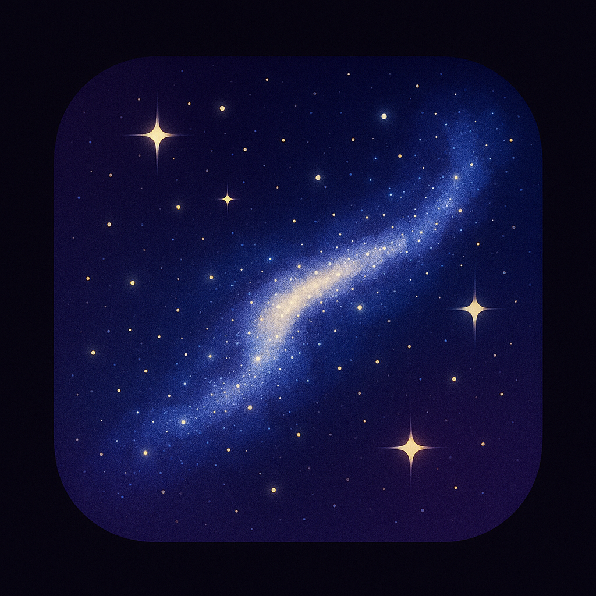
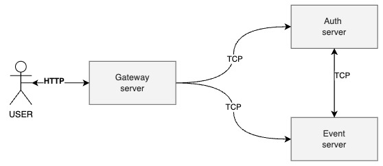

<!-- Improved compatibility of back to top link: See: https://github.com/othneildrew/Best-README-Template/pull/73 -->

<a id="readme-top"></a>


[](https://www.linkedin.com/in/heeguyang)

[circleci-image]: https://img.shields.io/circleci/build/github/nestjs/nest/master?token=abc123def456
[circleci-url]: https://circleci.com/gh/nestjs/nest

# Project Milkyway

<!-- PROJECT LOGO -->
<br />
<div align="center">

  <a href="https://github.com/thursdaycurry/nestjs-msa-milkyway">
    
  </a>

  <h3 align="center">Project Milkyway</h3>

  <p align="center">
    MSA system for managing user events and rewards in a gaming environment
    <br />
    <a href="https://github.com/thursdaycurry/nestjs-msa-milkyway"><strong>Explore the docs »</strong></a>
    <br />
    <br />
    <!-- <a href="https://github.com/thursdaycurry/nestjs-msa-milkyway">View Demo</a> -->
    &middot;
    <a href="https://github.com/thursdaycurry/nestjs-msa-milkyway/issues/new?labels=bug&template=bug-report---.md">Report Bug</a>
    &middot;
    <a href="https://github.com/thursdaycurry/nestjs-msa-milkyway/issues/new?labels=enhancement&template=feature-request---.md">Request Feature</a>
  </p>
</div>

<!-- TABLE OF CONTENTS -->

## Table of Contents

- [About The Project](#about-the-project)
  - [Built With](#built-with)
  - [Architecture](#architecture)
    - [Abstract Architecture](#abstract-architecture)
    - [APIs Structure](#apis-structure)
- [Getting Started](#getting-started)
  - [Prerequisites](#prerequisites)
  - [Installation](#installation)
  - [Endpoint](#endpoint)
  - [Test](#test)
- [Thoughts](#thoughts)
  - [이벤트 설계 의도](#이벤트-설계-의도)
  - [이벤트 보상 충족 검사 로직에 대한 생각](#이벤트-보상-충족-검사-로직에-대한-생각)
  - [3 Layered Architecture 구조](#3-layered-architecture-구조)
  - [Event Listener 모듈 추가 이유](#event-listener-모듈-추가-이유)
  - [RBAC의 구현 지점에 대한 고민](#rbacrole-based-access-control의-구현-지점에-대한-고민)
  - [User 엔티티 구성에 대한 고민](#user-엔티티-구성에-대한-고민)
  - [조건 검증 방식](#조건-검증-방식)
  - [통합 로깅 시스템에 대한 고민](#통합-로깅-시스템에-대한-고민)
  - [Access Token만 개발한 이유](#access-token만-개발한-이유)
- [Contact](#contact)
- [Acknowledgments](#acknowledgments)

<!-- ABOUT THE PROJECT -->

## About The Project

Project [Milkyway](https://github.com/thursdaycurry/nestjs-msa-milkyway)(은하수)는 유저 이벤트 및 보상 관리를 위한 서버 시스템입니다.

게임 세계에서 유저와 서버 간에 끊임없이 발생하는 다양한 이벤트를, 수많은 별들이 생겨나고 사라지는 은하수에 비유하여 이 이름을 붙였습니다.

### Built With

- [![TypeScript][TypeScript]][TypeScript-url]
- [![NestJS][NestJS]][NestJS-url]
- [![JWT][JWT]][JWT-url]
- [![MongoDB][MongoDB]][MongoDB-url]
- [![Docker][Docker]][Docker-url]
- [![Docker Compose][Docker Compose]][Docker Compose-url]

### Architecture

#### abstract architecture



```
[Client]
  ↓
[Gateway Server] (게이트웨이, JWT 및 역할 검증, 라우팅)
  ├─> [Auth Server] (회원가입, 로그인, JWT 발급, 역할 관리)
  └─> [Event Server] (이벤트 및 보상 등록, 조회, 요청 처리)
```

시스템 아키텍처는 Nest.js 기반의 마이크로서비스(MSA)로 구성되었습니다. 게이트웨이는 시스템의 진입점 역할을 하며 JWT 및 역할 검증, 라우팅을 담당합니다. 역할 또는 JWT 토큰의 검증을 통해 요청을 필터링합니다. Auth 서버는 유저 등록, 로그인, 역할 관리 뿐만 아니라 JWT 토큰 발급 등을 관리합니다. Event 서버는 이벤트, 보상에 관한 등록, 조회, 요청 처리 등을 관리합니다.

#### APIs structure


게임 운영에 필요한 이벤트 및 보상 관리 작업들을 자동화하기 위한 api들을 제공합니다.

인증 및 권한 관리

- 유저 등록
- 유저 로그인
- 사용자 역할 관리(USER, OPERATOR, AUDITOR, ADMIN)
- 역할 접근 제어

이벤트 시스템

- 다양한 유형의 이벤트 생성 및 관리(예: LOGIN)
- 이벤트 조건 설정 (예: 특정 기간동안 로그인 7일 충족 조건 등)

보상 시스템

- 보상 생성 및 관리
- 보상 아이템 생성 및 관리
- 사용자 보상 요청 처리
- 보상 요청 이력 조회

테스트 도구

- Swagger
  문서화: Markdown

## Getting Started

### Prerequisites

필수 조건

- Node.js 18 이상: NestJS 애플리케이션 실행을 위해 필요합니다.
- MongoDB
- Docker & Docker Compose
- Git

선택 사항

- REST Client Extension (VS Code용) : Swagger API 문서 참조가 안되는 경우 루트 디렉토리에 제공된 .http 파일을 사용하여 API 엔드포인트를 테스트하는 데 사용됩니다.

### Installation

설치를 위한 가이드입니다.

1. 프로젝트 클론
   ```sh
   git clone https://github.com/thursdaycurry/nestjs-msa-milkyway.git
   ```
2. NPM 설치

   ```sh
   cd nestjs-msa-milkyway
   npm install
   ```

3. Docker 설치
   ```sh
   docker-compose up --build
   ```

### endpoint

- Swagger: `http://localhost:3000/api`
- Gateway API: `http://localhost:3000`
- MongoDB: `mongodb://localhost:27017`

### Test

테스트 방법은 3가지 있습니다.

#### 1. Swagger 테스트(추천)

```sh
http://localhost:3000/api
```

#### 2. REST Client 테스트

```sh
$ project-directory/REST-client.http
```

## Thoughts

### 이벤트 설계 의도

이벤트 설계의 핵심은 보상 여부입니다. 보상을 주지 못하면 유저의 신뢰를 잃을 것이고, 과도한 보상이 발생할 경우 인플레이션이 발생하여 게임 내 경제 시스템에 문제가 될 수 있습니다.

이벤트의 주요 프로퍼티는 아래와 같습니다.

- category: LOGIN, FRIEND_INVITE, PURCHASE
- triggerType: SINGLE, STREAK
- goal: 7
- startDate: 2025-05-20T02:08:33.000Z
- endDate: 2025-05-20T02:08:33.000Z
- status: ON, OFF
- …

이벤트는 `category`(예: 로그인, 초대) 어느 기간(`startDate` ~ `endDate`)동안 어떤 조건(`triggerType`)(예: 단일, 연속)에 발동되며 현재는 어떤 상태(`status`)인지가 보상 여부를 결정합니다. `goal`은 조건의 양(예: 7일은 goal이 7)을 나타냅니다. 위 항목들을 참고하여 유저들에게 보상을 할 것인지 아닌지를 결정하기 때문입니다.

유저의 보상 요청(`claimReward`) 이벤트가 발생하면 아래와 같은 순서로 보상 거절 가능성을 검토합니다. 만약 거절 사유를 찾지 못했을 경우 보상을 허락하는 방식입니다.

1. 보상 요청한 이벤트가 존재하지 않음 → 거절
2. 이벤트가 현재 비활성화( `OFF` )상태임 → 거절
3. 이벤트 기간이 지남 → 거절
4. 유저가 해당 이벤트에 이미 보상을 받음→ 거절
5. 유저가 보상 기준에 충족되지 않음 → 거절
6. 보상 진행

### 이벤트 보상 충족 검사 로직에 대한 생각

보상 조건의 유형이 다양화될 수록 복잡도가 빠르게 증가합니다. 따라서 그 검증 로직을 함수형으로 잘 표준화해두어야 합니다.

이벤트 조건

- LOGIN
  - SINGLE
  - STREAK
  - COUNT
- FRIEND_INVITE
  - COUNT
- PURCHASE
  - COUNT

### 3 layered architecture 구조

이 프로젝트는 각 서버를 controller, service, repository 3가지 레이어로 구성하는 3계층 아키텍처 구조를 따르고 있습니다. 처음에는 controller, service 2가지 레이어로만 구성하는 방법을 생각해보았으나, service 레이어에 비즈니스 로직이 과도하게 집중되는 것을 방지하고 DB 제어를 추상화하고자 3계층 방식을 채택했습니다.

### Event Listener 모듈 추가 이유

로그인과 로그인 정보 저장은 별도의 이벤트입니다. 따라서 signin 이벤트 발생 시 로그인 작업과 로그인 정보 저장 로직을 디커플링 시키는 것이 적절하다고 생각했습니다. 이를 위해 event emitter를 활용했습니다. Event 서버의 보상 요청 API도 동일한 방식으로 보상 요청 기록을 적재하도록 구현했습니다. 개인적으로 이벤트 기반 통신으로 데이터를 처리하여 결합도를 낮추는 방식에 흥미를 느꼈습니다.

### RBAC(Role-Based Access Control)의 구현 지점에 대한 고민

인증/인가를 담당하는 Auth 서버에서 RBAC를 처리하면 관심사 분리가 명확해지고, 역할 및 토큰 정보를 이중으로 관리할 필요가 없습니다. 그러나 Gateway에 역할 검사를 두면 검증되지 않은 요청을 사전에 차단할 수 있어 트래픽 부담을 줄이고 보안성이 향상됩니다. 특히 MSA 환경에서 서비스가 증가할수록 요청 검증이 빈번해지므로, 검증 로직을 중앙화해 비용을 줄인다는 점에서 Gateway에서 RBAC를 처리하는 것이 더 효율적이라 생각했습니다.

### User 엔티티 구성에 대한 고민

처음 User 엔티티를 구현할 때, user_credential 엔티티(email, password)와 user_detail(role) 엔티티 두 가지로 구분해야하는 가에 대해 생각했습니다. 하지만 MongoDB에서는 RDBMS처럼 정규화를 강제하지 않기 때문에 데이터를 한 도큐먼트에 모두 두고 유연하게 활용할 수 있어서 하나의 엔티티로 통합했습니다. 하지만 비밀번호 같은 민감 정보는 보안을 위해 각기 다른 컬렉션에서 관리하는 등 논리적으로 격리하는 것도 좋겠다는 생각이 들었습니다.

### 조건 검증 방식

JWT 토큰 검증 및 역할 검사는 passport 라이브러리와 guard를 활용하여 구현했습니다. 그 이유는 데코레이터로 코드의 간결함을 살리면서도 nest.js 공식 문서에서 권고하는 표준 방식이기 때문입니다. 예를 들어, Strategy에서 유효성 검증 성공 시 req.user에 사용자 정보를 담게 되는데, 이는 Passport.js의 내부 규약이자 표준입니다.

### 통합 로깅 시스템에 대한 고민

유저 로그인 시도 기록은 auth 서버의 DB에, 그리고 보상 요청 기록은 event 서버의 DB에 각각 적재하고 있습니다. 하지만 이 로그성 데이터들은 기하급수적으로 쌓일 가능성이 있으므로 일반적인 DB에 적재하는 것이 부담이 될 수도 있습니다. 개선할 수 있다면 통합 로그 서버를 만들어서 MSA의 로그들을 통합적으로 관리하는 방식도 좋을 것 같습니다. 그렇게 되면 ELK 스택을 활용하여 애널리틱스 서비스도 개발할 수 있습니다. 또 다른 대안으로 데이터 유통기한(TTL)을 두어 자동 삭제하거나 저렴한 스토리지에 옮겨두는 방식도 좋을 것 같습니다.

### access token만 개발한 이유

refresh 토큰은 access 토큰과 함께 유저에게 반환됩니다. 단, access 토큰은 stateless하지만 refresh 토큰은 서버에서 직접 보관합니다. 이는 언제라도 refresh 토큰을 무효화하여 서버가 세션에 대한 통제권을 가지기 위함입니다. 하지만 이벤트 및 보상 요청은 유저 입장에서 요청하지 않고 또 어드민 접근 또한 세션을 길게 둘 경우 사회 공학적 차원에서 보안 취약점(이직한 동료가 다음날 어드민 사이트에 로그인해버림)이 있습니다. 따라서 서버는 클라이언트 간 세션을 길게 유지할 필요가 없기 때문에 refresh 토큰은 사용하지 않고 access 토큰의 수명을 조금 길게 가져가는 방법이 좋다고 생각했습니다.

## Contact

Heegu Yang - [@linkedin](https://www.linkedin.com/in/heeguyang/) - thursdaycurry@gmail.com

Project Link: [https://github.com/thursdaycurry/nestjs-msa-milkyway](https://github.com/thursdaycurry/nestjs-msa-milkyway)

<!-- ACKNOWLEDGMENTS -->

## Acknowledgments

이 프로젝트를 만드는데 도움이 되었던 자료 또는 사이트들

- [NestJS Official documents](https://docs.nestjs.com/)
- [MongoDB](https://www.mongodb.com/)

<p align="right">(<a href="#readme-top">back to top</a>)</p>

<!-- MARKDOWN LINKS & IMAGES -->
<!-- https://www.markdownguide.org/basic-syntax/#reference-style-links -->

[contributors-shield]: https://img.shields.io/github/contributors/othneildrew/Best-README-Template.svg?style=for-the-badge
[contributors-url]: https://github.com/othneildrew/Best-README-Template/graphs/contributors
[forks-shield]: https://img.shields.io/github/forks/othneildrew/Best-README-Template.svg?style=for-the-badge
[forks-url]: https://github.com/othneildrew/Best-README-Template/network/members
[stars-shield]: https://img.shields.io/github/stars/othneildrew/Best-README-Template.svg?style=for-the-badge
[stars-url]: https://github.com/othneildrew/Best-README-Template/stargazers
[issues-shield]: https://img.shields.io/github/issues/othneildrew/Best-README-Template.svg?style=for-the-badge
[issues-url]: https://github.com/othneildrew/Best-README-Template/issues
[license-shield]: https://img.shields.io/github/license/othneildrew/Best-README-Template.svg?style=for-the-badge
[license-url]: https://github.com/othneildrew/Best-README-Template/blob/master/LICENSE.txt
[linkedin-shield]: https://img.shields.io/badge/-LinkedIn-black.svg?style=for-the-badge&logo=linkedin&colorB=555
[linkedin-url]: https://linkedin.com/in/othneildrew
[product-screenshot]: images/screenshot.png
[Next.js]: https://img.shields.io/badge/next.js-000000?style=for-the-badge&logo=nextdotjs&logoColor=white
[Next-url]: https://nextjs.org/
[React.js]: https://img.shields.io/badge/React-20232A?style=for-the-badge&logo=react&logoColor=61DAFB
[React-url]: https://reactjs.org/
[Vue.js]: https://img.shields.io/badge/Vue.js-35495E?style=for-the-badge&logo=vuedotjs&logoColor=4FC08D
[Vue-url]: https://vuejs.org/
[Angular.io]: https://img.shields.io/badge/Angular-DD0031?style=for-the-badge&logo=angular&logoColor=white
[Angular-url]: https://angular.io/
[Svelte.dev]: https://img.shields.io/badge/Svelte-4A4A55?style=for-the-badge&logo=svelte&logoColor=FF3E00
[Svelte-url]: https://svelte.dev/
[Laravel.com]: https://img.shields.io/badge/Laravel-FF2D20?style=for-the-badge&logo=laravel&logoColor=white
[Laravel-url]: https://laravel.com
[Bootstrap.com]: https://img.shields.io/badge/Bootstrap-563D7C?style=for-the-badge&logo=bootstrap&logoColor=white
[Bootstrap-url]: https://getbootstrap.com
[JQuery.com]: https://img.shields.io/badge/jQuery-0769AD?style=for-the-badge&logo=jquery&logoColor=white
[JQuery-url]: https://jquery.com
[NestJS]: https://img.shields.io/badge/NestJS-000000?style=for-the-badge&logo=nestjs&logoColor=white
[NestJS-url]: https://nestjs.com
[MongoDB]: https://img.shields.io/badge/MongoDB-47A248?style=for-the-badge&logo=mongodb&logoColor=white
[MongoDB-url]: https://www.mongodb.com/
[Docker]: https://img.shields.io/badge/Docker-2496ED?style=for-the-badge&logo=docker&logoColor=white
[Docker-url]: https://www.docker.com/
[Docker Compose]: https://img.shields.io/badge/Docker%20Compose-2496ED?style=for-the-badge&logo=docker&logoColor=white
[Docker Compose-url]: https://www.docker.com/
[TypeScript]: https://img.shields.io/badge/TypeScript-007ACC?style=for-the-badge&logo=typescript&logoColor=white
[TypeScript-url]: https://www.typescriptlang.org/
[JWT]: https://img.shields.io/badge/JWT-000000?style=for-the-badge&logo=jsonwebtokens&logoColor=white
[JWT-url]: https://jwt.io/
