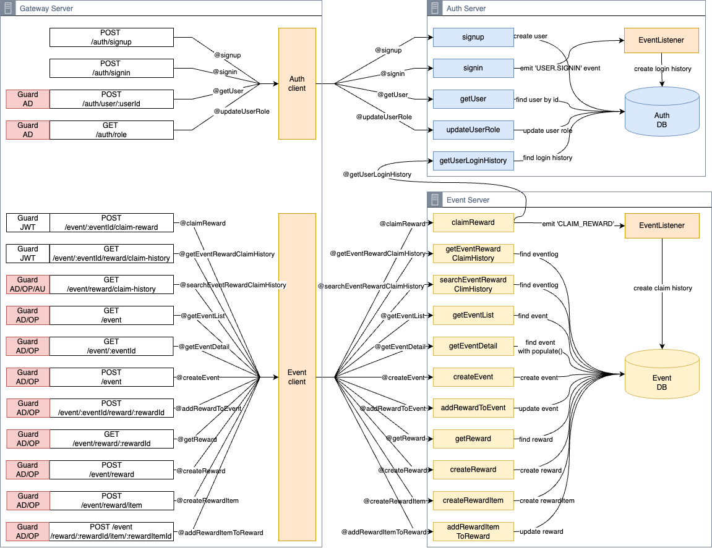

## TODO

- [ ] refresh token
- [ ]

paris 요청 백엔드 레이턴시 줄이려고, 백엔드 multi region 두고 프론트엔드는 서울에만 뒀는데. 캐싱 동기화 문제. next.js는 ssr 적용해서, next.js 서버가 클라이언트가 되서 레디스 관련 토큰은 paris가 아닌 아시아에 저장되는 것이 문제. 해결하려면 프론트를 각 리전별로 두거나, 레디스 클러스터링 sync해서 해결할 수 있음.

[circleci-image]: https://img.shields.io/circleci/build/github/nestjs/nest/master?token=abc123def456
[circleci-url]: https://circleci.com/gh/nestjs/nest

## Description

Project [Milkyway](https://github.com/thursdaycurry/nestjs-msa-milkyway)(은하수)는 유저 이벤트 및 보상 관리를 위한 서버 시스템입니다.

게임 세계에서 유저와 서버 간에 끊임없이 발생하는 다양한 이벤트를, 수많은 별들이 생겨나고 사라지는 은하수에 비유하여 이 이름을 붙였습니다.

## Install

## System Architecture - abstract

## System Architecture - details



## 주요 기능

게임 운영에 필요한 이벤트 및 보상 관리 작업들을 자동화하기 위한 api들을 제공합니다.

인증 및 권한 관리

- JWT 기반 인증 시스템
- 유저 등록 및 로그인
- 역할 기반 접근 제어 (RBAC)
- 사용자 역할 관리(USER, OPERATOR, AUDITOR, ADMIN)

이벤트 관리

- 다양한 유형의 이벤트 생성 및 관리
- 이벤트 조건 설정 (예: 특정 기간동안 로그인 일수 충족 조건등)
  이벤트 기간 및 상태 관리

3. 보상 시스템
   보상 항목 생성 및 관리
   이벤트에 보상 연결
   사용자 보상 요청 처리

기술 스택
Backend
런타임: Node.js 18
프레임워크: NestJS (최신 버전)
데이터베이스: MongoDB
메시징: NestJS Microservices (TCP 전송)
인증: JWT (JSON Web Tokens)
이벤트 처리: EventEmitter

개발 도구
API 테스트: REST Client (HTTP 파일 기반)
문서화: Markdown

## 1. 요구사항

Gateway Server

- 요청의 진입점
- 라우팅
- JWT 토큰 검증 및 역할 검사
- Nest.js `@nestjs/passport`, `AuthGuard`, `RoleGuard` 사용 할 것

Auth Service

- 유저 등록
- 유저 로그인
- 유저 역할 관리
- JWT 관리

역할 유형

- USER : 보상 요청
- OPERATOR : 이벤트 등록 + 보상 등록
- AUDITOR : 보상 이력 조회
- ADMIN : 모든 기능

User Service

1. 이벤트 등록 / 조회

- 이벤트 생성 가능. 운영자 또는 관리자
- 이벤트는 조건(로그인 3일, 친구 초대), 기간, 상태(활성/비활성) 정보를 가진다.
- 등록 이벤트는 목록 또는 상세 조회 가능

기술 스택

- Node.js : 18
- Nest.js : 최신
- DB : MongoDB
- 인증 : JWT
- 배포/실행 : Docker + Docker Compose
- 언어 : TypeScript

## 2. 시스템 설계

```
[Client]
  ↓
[Gateway Server] (게이트웨이, JWT 검증, 라우팅)
  ├─> [Auth Server] (회원가입, 로그인, JWT 발급, 역할관리)
  └─> [Event Server] (이벤트 등록, 보상 등록, 요청 처리)
```

ERD

## Project setup

## Thought

dto validation은 어디서 해야하나

- dto validation 파이프를 gateway에 둬야하나 아니면 Auth에 둬야하나? gateway 두면 검증된 데이터만 네트워크 전송을 쓰기 때문에 트래픽 부담이 줄지만, 그렇게되면 auth의 dto가 gateway에 존재함에 따라 관심사 분리 원칙에 위배된다.
  하지만 gateway은 라우팅도 하지만 불필요한 요청을 방지하는 관문 역할 한다는 점에서 validation하는 것이 적절하다.

passport

- Strategy에서 validate의 반환값은 객체인데, 이는 req.user의 값에 할당된다. 왜 하필 req.user인 이유는 Authentication 성공 시 req.user에 사용자 정보를 넣으라는Passport.js의 표준이며 내부 규약이다.

```typescript
// apps/gateway/src/common/strategies/jwt.strategy.ts
import { Injectable } from "@nestjs/common";
import { PassportStrategy } from "@nestjs/passport";
import { Strategy } from "passport-jwt";

@Injectable()
export class JwtStrategy extends PassportStrategy(Strategy) {
  constructor() {
    super({
      jwtFromRequest: ExtractJwt.fromAuthHeaderAsBearerToken(),
      ignoreExpiration: false,
      secretOrKey: process.env.JWT_SECRET,
    });
  }

  async validate(payload) {
    return {
      userId: payload.sub,
      email: payload.email,
      loginType: payload.loginType,
    };
  }
}
```

역할 제어가 중요한 시스템이기 때문에 역할 제어를 분산시키지 않고 한 곳에 두어 검증 비용을 줄일 수 있다

## Event

이벤트 7일 연속 로그인

조건은 보상 조건 뿐만 아니라 생성 조건도 필요하다. 생성 조건의 경우, 만약 7일 연속 로그인 이벤트라면 이벤트 기간이 최소 7일 이상이어야 한다.

연속 로그인 이벤트를 기록하기 위해선 login_history를 생성해야 한다.

login_history DB는 auth 데이터이고, event는 event 데이터다. 두 유형의 데이터를 같은 DB의 다른 테이블로 구성할 것인지, 아니면 애초에 다른 DB로 구성할 것인가?

같은 DB를 쓴다면, 같은 DB 인스턴스를 사용하면 된다. 그러니 다른 DB를 사용할 경우, 해당 데이터를 얻기 위해 다른 서버에 요청을 하는 방식으로 처리해야 한다.

MSA는 다른 서비스들 간 데이터를 하나의 DB에서 공유하는 직접 DB 접근 방식 보다는 이벤트 기반 통신으로 데이터를 요청해서 처리하는 것이 서비스 결합도를 낮추는데 도움이 될 것이다. 물론, 따로 DB를 두면 성능이 상대적으로 느리거나, 데이터 동기화의 필요성 등 단점도 있다.
API 방식이 업계 표준.

Auth 서버에서는
로그인을 할 경우, 해당 로직을 수행하되 병렬적으로 로그인 이벤트를 발생(emit)시켜 해당 이벤트를 적재하는 방식을 취한다. 그리고 해당 이벤트를 받은 이벤트 리스너는 로그인 히스토리에 이벤트를 적재한다.

로그인과 로그인 정보 저장은 별도의 이벤트다. 따라서 signin api에서는 로그인 정보 저장 로직을 디커플링 시켜야 하며 이를 위해 event emitter를 사용할 것이다.

이벤트 유형
다양한 유형의 이벤트를 여러개 등록하고 싶은데 표준화를 어떻게 해야하지?

## test

테스트 방법

```
# Swagger api
http://localhost:3000/api
```

```
# MongoDB
localhost:27017
```

NestJS MSA User Event Management System
Overview
이 프로젝트는 NestJS 기반의 마이크로서비스 아키텍처를 활용한 사용자 이벤트 관리 시스템입니다. 사용자 인증, 권한 관리, 이벤트 생성 및 관리를 위한 종합적인 솔루션을 제공합니다.

시스템 아키텍처
개요
Gateway Service: API 게이트웨이로 모든 외부 요청의 진입점 역할
Auth Service: 사용자 인증 및 권한 관리
Event Service: 이벤트 및 보상 관리

API 엔드포인트
인증 (Auth)
POST /auth/signup - 사용자 등록
POST /auth/signin - 로그인
POST /auth/user/role - 사용자 역할 업데이트 (ADMIN 전용)
GET /auth/user/:id - 사용자 정보 조회
이벤트 (Event)
POST /event - 새 이벤트 생성
GET /event - 이벤트 목록 조회
GET /event/:id - 특정 이벤트 조회
POST /event/reward - 새 보상 생성
POST /event/:eventId/claim-reward - 보상 요청

## Tech stack

- Runtime: Node.js 18
- Framework: Nest.js
- DB: MongoDB
- Authentication: JWT
- Deployment: Docker + Docker Compose
- Language: TypeScript

## Requirments

설치 및 실행

- Node.js 18 이상
- MongoDB 인스턴스
- npm 또는 yarn

```
git clone https://github.com/thursdaycurry/nestjs-msa-milkyway.git

cd milkyway

docker-compose up --build
```

## port

기본 localhost:3000

api

- localhost:3000/auth/a...

# 루트 디렉토리에서

npm install

# 각 서비스별로 의존성 설치

cd apps/auth && npm install
cd ../event && npm install
cd ../gateway && npm install
환경 변수 설정:
.env 파일을 생성하고 필요한 환경 변수를 설정하세요.
필수 환경 변수:
CopyInsert
MONGODB_URI=mongodb://localhost:27017/user-event
JWT_SECRET=your_jwt_secret
JWT_EXPIRES_IN=1h
실행
bash
CopyInsert

# 개발 모드로 모든 서비스 실행

npm run start:dev

# 또는 각 서비스별로 실행

# 게이트웨이

cd apps/gateway && npm run start:dev

# 인증 서비스

cd apps/auth && npm run start:dev

# 이벤트 서비스

cd apps/event && npm run start:dev
테스트
프로젝트에는 REST Client를 사용한 API 테스트 파일이 포함되어 있습니다. REST-client.http 파일을 사용하여 다양한 엔드포인트를 테스트할 수 있습니다.

라이센스
이 프로젝트는 MIT 라이센스 하에 배포됩니다.
